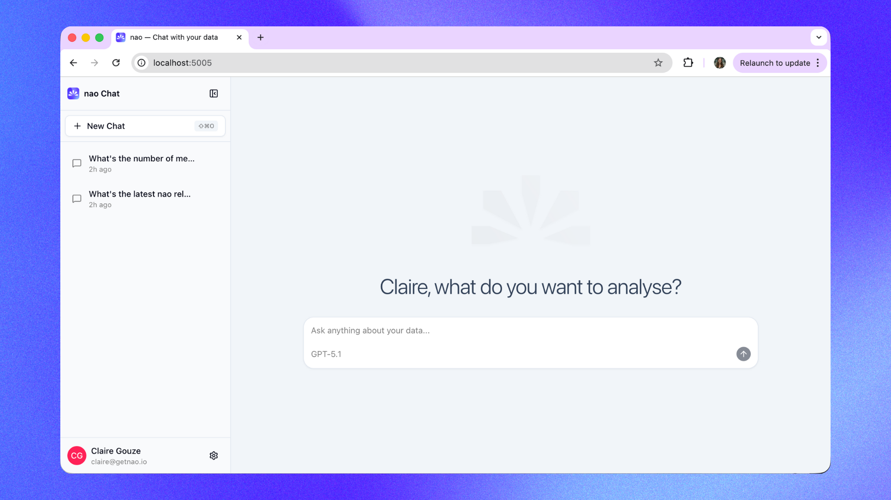

<p align="center">
  <a href="https://getlysmart.io">
    <picture>
      <source media="(prefers-color-scheme: dark)" srcset=".github/images/Icon_template_IOS.svg" />
      
    </picture>
  </a>
</p>

<h1 align="center">LySmart</h1>

<h3 align="center">
  The #1 Open-Source Analytics Agent
</h3>

<p align="center">
  🌐 <a href="https://getlysmart.io">Website</a> · 📚 <a href="https://docs.getlysmart.io">Documentation</a> · 💬 <a href="https://join.slack.com/t/lysmart-labs/shared_invite/zt-3cgdql4up-Az9FxGkTb8Qr34z2Dxp9TQ">Slack</a>
</p>

<br/>

<p align="center">
  <a href="https://getlysmart.io">
    
  </a>
</p>

<br/>

## What is LySmart?

LySmart is a framework to build and deploy analytics agent. <br/>
Create the context of your analytics agent with lysmart-core cli: data, metadata, modeling, rules, etc. <br/>
Deploy a UI for anyone to chat with your agent and run analytics on your data.

## Key Features

For **data teams**:

- 🧱 **Open Context Builder** — Create a file-system like context for your agent. Add anything you want in the context: data, metadata, docs, tools, MCPs. No limit.
- 🏳️ **Data Stack Agnostic** — Works with any data warehouse, stack, type of context, LLM.
- 🕵🏻‍♀️ **Agent Reliability Visibility** — Unit test your agent performance before deploying it to users. Version the context and track the performance of your agent over time. Get users feedbacks to improve the agent and track their usage.
- 🔒 **Self-hosted & secure** — Self-host your analytics agent and use your own LLM keys to guarantee maximum security for your data.

For **business users**:

- 🤖 **Natural Language to Insights** — Ask questions in plain English, get analytics straight away
- 📊 **Native Data Visualization** — Create and customize visualizations directly in the chat interface
- 🧊 **Transparent Reasoning** — See the agent reasoning and sources clearly
- 👍 **Easy Feedback** — Send feedback to the data team when a answer is right or wrong

## ⚡️ Quickstart your agent in 1 minute

- **Step 1**: Install lysmart-core package

    ```bash
    pip install lysmart-core
    ```

<br/>

- **Step 2**: Initialize a LySmart project

    ```bash
    lysmart init
    ```

    It will ask you:
    - To name your project
    - If you want to connect a database _(optional)_
    - If you want to add a repo in agent context _(optional)_
    - To add an LLM key _(optional)_
    - If you want to setup a Slack connection _(optional)_

    💡 You can skip any optional question and configure them later in your `lysmart_config.yaml` file.

    This will create:
    - A new folder with your project name
    - An architecture for your context files
    - A `lysmart_config.yaml` configuration file
    - A `RULES.md` file

<br/>

- **Step 3**: Verify your setup

    cd to the project folder and run:

    ```bash
    lysmart debug
    ```

<br/>

- **Step 4**: Synchronize your context

    ```bash
    lysmart sync
    ```

    This will populate your context folder with your context files (data, metadata, repos, etc.)

<br/>

- **Step 5**: Launch the chat and ask questions

    ```bash
    LySmart chat
    ```

    This will start the LySmart chat UI. It will open the chat interface in your browser at `http://localhost:5005`.
    From there, you can start asking questions to your agent.

## Evaluation framework

Unit test your agent performance before deploying it to users. First, create a folder `tests/` with questions and expected SQL in yaml.
Then, measure agent's performance on examples with lysmart test command:

```bash
lysmart test
```

View results in tests panel:

```bash
lysmart test server
```

## Commands

```bash
lysmart --help
Usage: lysmart COMMAND

╭─ Commands ────────────────────────────────────────────────────────────────╮
│ chat         Start the LySmart chat UI.                                       │
│ init         Initialize a new LySmart project.                                │
│ sync         Sync context from your context sources (databases, repos)    │
│ test         Measure agent's performance on test examples.                │
│ debug        Debug and troubleshoot your LySmart setup.                       │
│ --help (-h)  Display this message and exit.                               │
│ --version    Display application version.                                 │
╰───────────────────────────────────────────────────────────────────────────╯
```

## 🐳 Docker

Pull the image from DockerHub:

```bash
docker pull getlysmart/lysmart:latest
```

Run LySmart chat with Docker using the example project bundled in the image:

```bash
docker run -d \
  --name lysmart \
  -p 5005:5005 \
  -e BETTER_AUTH_URL=http://localhost:5005 \
  getlysmart/lysmart:latest
```

Run LySmart chat with Docker using your local LySmart project:

```bash
docker run -d \
  --name lysmart \
  -p 5005:5005 \
  -e BETTER_AUTH_URL=http://localhost:5005 \
  -v /path/to/your/lysmart-project:/app/project \
  -e NAO_DEFAULT_PROJECT_PATH=/app/project \
  getlysmart/lysmart:latest
```

Access the UI at http://localhost:5005 (or at any URL you configured).

See the [DockerHub page](https://hub.docker.com/r/getlysmart/lysmart) for more details.

For end-to-end self-hosted deployment (for example on Cloud Run with PostgreSQL), see the [Deployment Guide](https://docs.getlysmart.io/lysmart-agent/self-hosting/deployment-guide).

## 👩🏻‍💻 Development

See [CONTRIBUTING.md](CONTRIBUTING.md) for development setup, commands, and guidelines.

## 📒 Stack

### Backend

- Fastify: https://fastify.dev/docs/latest/
- Drizzle: https://orm.drizzle.team/docs/get-started
- tRPC router: https://trpc.io/docs/server/routers

### Frontend

- tRPC client: https://trpc.io/docs/client/tanstack-react-query/usage
- Tanstack Query: https://tanstack.com/query/latest/docs/framework/react/overview
- Shadcn: https://ui.shadcn.com/docs/components

## ⛹️‍♀️ Join the Community

- Star the repo
- Subscribe to releases (Watch → Custom → Releases)
- Follow us on [LinkedIn](https://www.linkedin.com/company/getlysmart)
- Join our [Slack](https://join.slack.com/t/lysmart-labs/shared_invite/zt-3cgdql4up-Az9FxGkTb8Qr34z2Dxp9TQ)
- Contribute to the repo!

## 🫰🏻 Partners

LySmart Labs is a proud Y Combinator company!

<a href="https://ycombinator.com/">
    
</a>

## 📄 License

This project is licensed under the Apache 2.0 License - see the [LICENSE](LICENSE) file for details.
